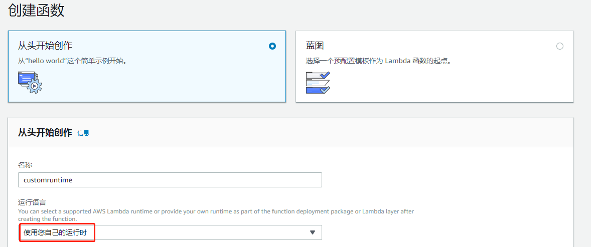
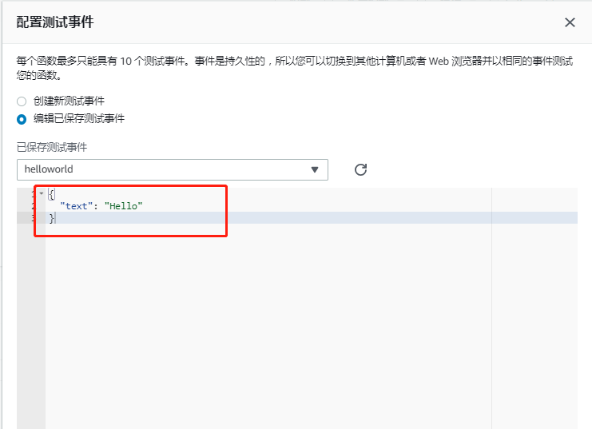
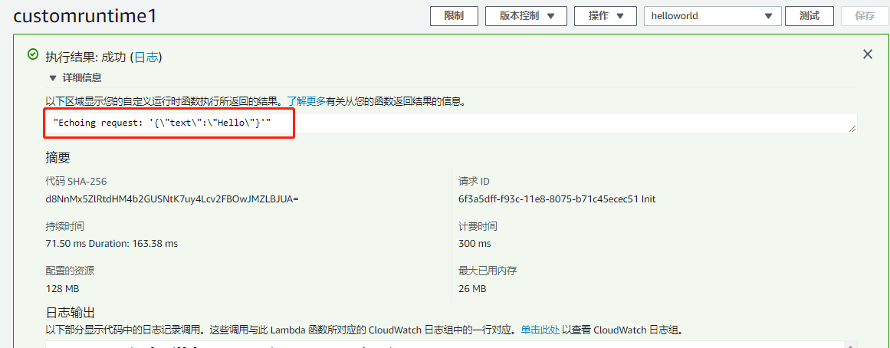
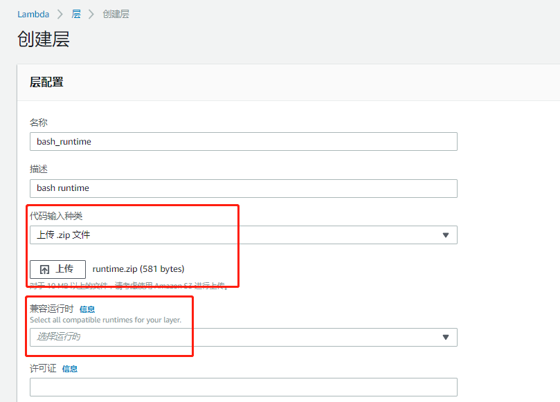
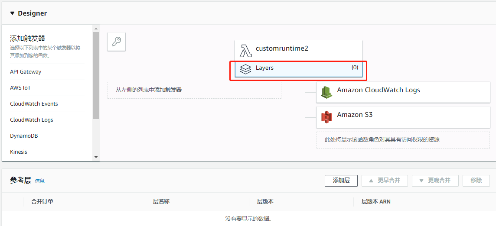
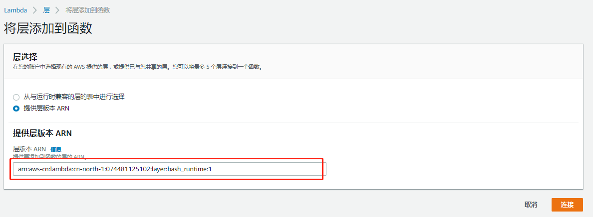
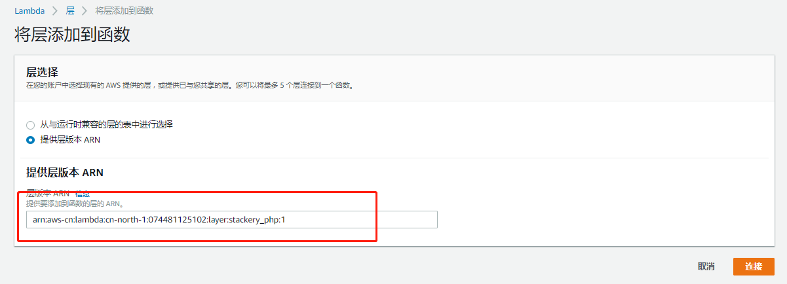
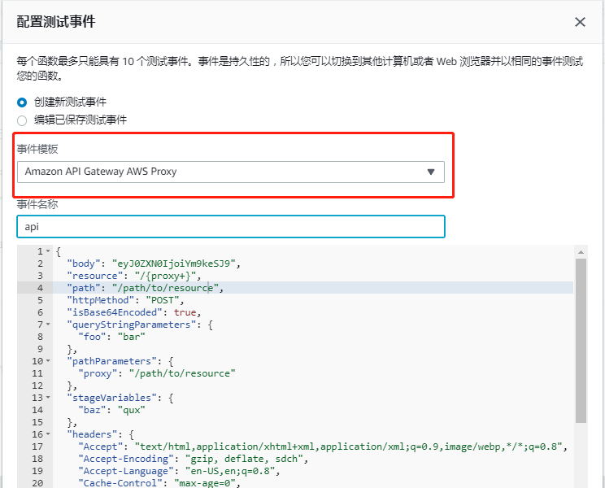

# 关于这个项目
这是一个帮助你学习Lambda custom runtime的小项目。

内容包括了：
- [lambda custom runtime工作原理的解释](#什么是lambda-custom-runtime)
- [3个动手小实验](#小实验)

# 什么是lambda custom runtime
## 背景
lambda原来只能支持有限的语言种类，包括node.js, python, .Net, Go, java, ruby等。 

如果需要在Lambda上运行不支持的语言或者二进制文件该怎么办呢？原先有一种比较有趣的方案，其实就是用已经支持的语言来写一个代理，包装在不被支持的语言的二进制运行文件之上。（参考 [在lambda上运行其他语言](https://github.com/lazydragon/asap/tree/master/other_language)）

而lambda custom runtime就是正统的这个问题的解决方案。

AWS新出的官方对于c++和rust的支持其实都是基于custom runtime来实现的，底层都使用了runtime API技术。
- [rust runtime](https://github.com/awslabs/aws-lambda-rust-runtime)
- [cpp runtime](https://github.com/awslabs/aws-lambda-cpp)

## 什么是runtime API
runtime API 是aws lambda所提供的http API, 帮助custom runtime监听lambda的触发事件，和返回处理结果。

runtime API一共有4个API接口：
### 触发事件监听
HTTP请求类型： GET

HTTP请求路径： /runtime/invocation/next

```bash
  curl "http://${AWS_LAMBDA_RUNTIME_API}/2018-06-01/runtime/invocation/next"
```
### 返回正常处理结果
HTTP请求类型： POST

HTTP请求路径： /runtime/invocation/AwsRequestId/response

```bash
REQUEST_ID=156cb537-e2d4-11e8-9b34-d36013741fb9
curl -X POST  "http://${AWS_LAMBDA_RUNTIME_API}/2018-06-01/runtime/invocation/$REQUEST_ID/response"  -d "SUCCESS"
```
### 返回处理异常
HTTP请求类型： POST

HTTP请求路径： /runtime/invocation/AwsRequestId/error

```bash
REQUEST_ID=156cb537-e2d4-11e8-9b34-d36013741fb9
ERROR="{\"errorMessage\" : \"Error parsing event data.\", \"errorType\" : \"InvalidEventDataException\"}"
curl -X POST "http://${AWS_LAMBDA_RUNTIME_API}/2018-06-01/runtime/invocation/$REQUEST_ID/error"  -d "$ERROR"
```
### 返回初始化错误
HTTP请求类型： POST

HTTP请求路径： /runtime/init/error

```bash
REQUEST_ID=156cb537-e2d4-11e8-9b34-d36013741fb9
ERROR="{\"errorMessage\" : \"Failed to load function.\", \"errorType\" : \"InvalidFunctionException\"}"
curl -X POST "http://${AWS_LAMBDA_RUNTIME_API}/2018-06-01/runtime/init/error"  -d "$ERROR"
```

## runtime API的使用
runtime API的使用流程一般是:
1. 循环监听[触发事件监听API](#触发事件监听)
2. 对每次事件，使用相对应自定义代码处理
3. 根据处理的成功和失败，使用相对应的返回API返回结果
4. 将以上这些逻辑打包成为一个bootstrap可执行文件，上传到lambda 

接下来的小实验会帮助大家动手理解runtime API的使用方式，大家也可以之后参考rust runtime的[实现方式](https://github.com/awslabs/aws-lambda-rust-runtime/blob/master/lambda-runtime-client/src/client.rs)


# 小实验
1. [用custom runtime跑bash脚本](#用custom-runtime跑bash脚本)
2. [用layer分离runtime和lambda方法](#用layer分离runtime和lambda方法)
3. [用custom runtime跑php脚本](#用custom-runtime跑php脚本)

## 用custom runtime跑bash脚本
这个小实验当中，我们参考官方教程创建一个bash的custom runtime，实现简单的直接echo返回事件输入数据的功能。

### 1. 创建bootstrap和function代码

bootstrap
```bash
#!/bin/sh

set -euo pipefail

# Initialization - load function handler
source $LAMBDA_TASK_ROOT/"$(echo $_HANDLER | cut -d. -f1).sh"

# Processing
while true
do
  HEADERS="$(mktemp)"
  # Get an event
  EVENT_DATA=$(curl -sS -LD "$HEADERS" -X GET "http://${AWS_LAMBDA_RUNTIME_API}/2018-06-01/runtime/invocation/next")
  REQUEST_ID=$(grep -Fi Lambda-Runtime-Aws-Request-Id "$HEADERS" | tr -d '[:space:]' | cut -d: -f2)

  # Execute the handler function from the script
  RESPONSE=$($(echo "$_HANDLER" | cut -d. -f2) "$EVENT_DATA")

  # Send the response
  curl -X POST "http://${AWS_LAMBDA_RUNTIME_API}/2018-06-01/runtime/invocation/$REQUEST_ID/response"  -d "$RESPONSE"
done
```

function.sh
```bash
function handler () {
  EVENT_DATA=$1
  echo "$EVENT_DATA" 1>&2;
  RESPONSE="Echoing request: '$EVENT_DATA'"

  echo $RESPONSE
}
```

### 2. 打包bootstrap和function.sh到一个zip文件。
注意： bootstrap和function.sh都需要配置成为可执行文件，
大家也可以直接使用我已经打包好的[zip](./bash_example/function.zip)

### 3. 在控制台创建lambda并上传zip文件

创建lambda



上载zip包


### 4. 创建测试案例并测试


测试



## 用layer分离runtime和lambda方法
这个小实验中，我们在实验1的基础上面把bash的custom runtime分离到lambda layer([什么是layer?](https://github.com/hawkey999/lambda-layer-demo))上去。

因为layer是可以和多个lambda分享的，所以以后我们要写一个bash的lamda程序，只需要写一下自己的function.sh，然后再在该lambda上加入bash custom runtime layer就可以直接工作了！

### 1. 创建lambda
和实验一中的步骤一样创建lambda， 唯一的区别在于上载的zip包中现在只包含funtion.sh。

大家可以直接使用我已经打包好的[function_only.zip](./bash_layer_example/function_only.zip)

### 2. 打包layer代码
单独打包bootstrap代码到runtime.zip
大家可以直接使用我已经打包好的[runtime.zip](./bash_layer_example/runtime.zip)

### 3. 创建layer


记录下layer的ARN


### 4. 添加layer到lambda


注意：添加过程中请选择“提供层版本ARN”, 并填写刚才记录下的layer的ARN


### 5. 测试
和实验一中的测试步骤和结果相同

## 用custom runtime跑php脚本
在本实验当中，我们借用[stackery](https://github.com/stackery/php-lambda-layer)分享的php custom runtime来跑PHP的脚本,实现简单的hello world功能。

### 1. 创建lambda
创建index.php代码
```php
Hello World! You've reached <?php print($_SERVER['REQUEST_URI']); ?>
```
如实验1，2一样创建lambda，打包index.php，并上传。
大家可以直接使用我打包好的[function_php.zip](./php_example/function_php.zip)

注意：处理程序项要填写成 index.php

### 2. 添加php custom层
如实验2中一样在lambda上添加层。

大家可以直接使用我分享在中国北京区的php层。(arn:aws-cn:lambda:cn-north-1:074481125102:layer:stackery_php:1)


也可以自己如实验2一样创建新的php custom层。

关于创建php custom层时所需要使用的zip包，大家可以根据[stackery](https://github.com/stackery/php-lambda-layer)文档编译custom runtime,或直接下载我打包编译好的[php71.zip](./php_example/php71.zip)

### 3. 创建测试案例并测试
创建测试案例，选择API gateway lambda proxy模板。 注意：我们现在使用的stackery php层，默认识别的请求格式为API gateway lambda proxy格式。如果格式不同，需要修改配置或者runtime代码。


测试结果


# 后话
custom runtime通过runtime API的形式让lambda有了无限的可能性。什么是以前lambda不能做，现在却能做的事情呢？欢迎大家发挥想象，一起玩起来！

# 参考文献
- runtime api: https://docs.aws.amazon.com/zh_cn/lambda/latest/dg/runtimes-api.html
- 创建custom runtime官方教程: https://docs.aws.amazon.com/zh_cn/lambda/latest/dg/runtimes-walkthrough.html
